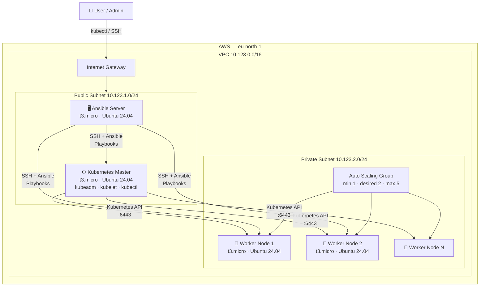
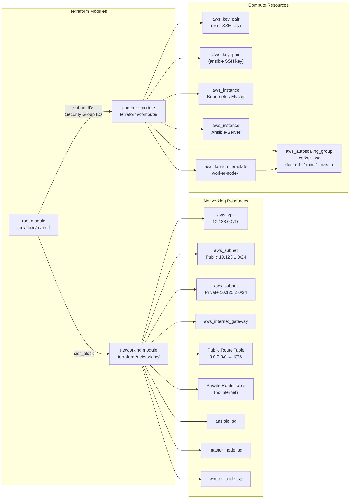
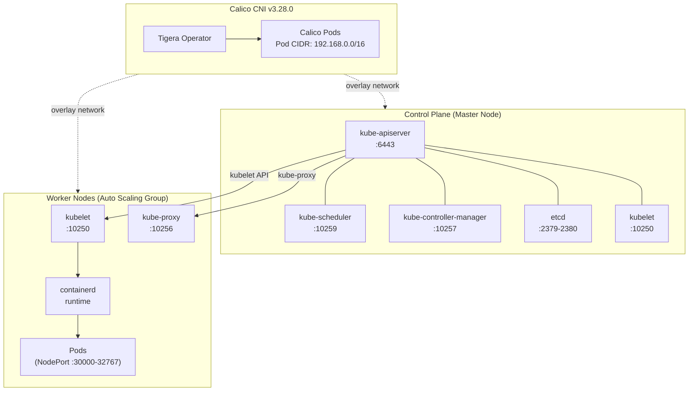
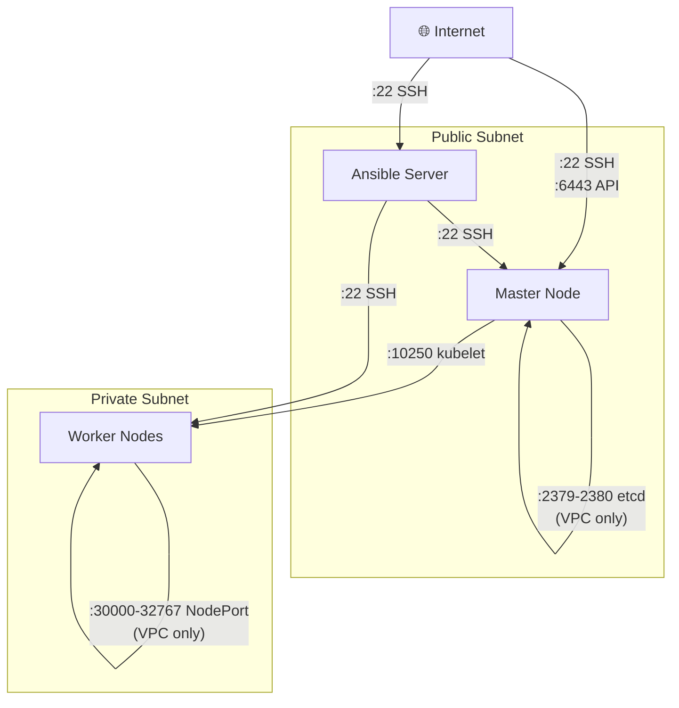
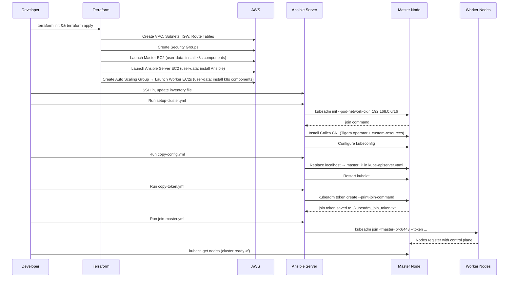

# kubeadm HA Cluster on AWS

Automates the provisioning and configuration of a **highly-available Kubernetes cluster** on AWS using **Terraform** (infrastructure) and **Ansible** (cluster bootstrap). The cluster runs Kubernetes 1.29 with the Calico CNI on Ubuntu 24.04 instances managed through an Auto Scaling Group.

---

## Table of Contents

- [Architecture Overview](#architecture-overview)
- [AWS Infrastructure](#aws-infrastructure)
- [Kubernetes Cluster Layout](#kubernetes-cluster-layout)
- [Network & Security Groups](#network--security-groups)
- [Setup Workflow](#setup-workflow)
- [Prerequisites](#prerequisites)
- [Quick Start](#quick-start)
  - [1. Provision Infrastructure with Terraform](#1-provision-infrastructure-with-terraform)
  - [2. Configure the Ansible Control Server](#2-configure-the-ansible-control-server)
  - [3. Bootstrap the Kubernetes Cluster](#3-bootstrap-the-kubernetes-cluster)
  - [4. Join Worker Nodes](#4-join-worker-nodes)
- [Repository Structure](#repository-structure)
- [Configuration Reference](#configuration-reference)

---

## Architecture Overview



---

## AWS Infrastructure

Terraform provisions all infrastructure in **eu-north-1** across two availability zones.



---

## Kubernetes Cluster Layout



---

## Network & Security Groups



| Security Group | Inbound Rules | Scope |
|---|---|---|
| **ansible_sg** | TCP 22 (SSH) | 0.0.0.0/0 |
| **master_node_sg** | TCP 22 (SSH) | 0.0.0.0/0 |
| | TCP 6443 (API server) | 0.0.0.0/0 |
| | TCP 2379–2380 (etcd) | VPC CIDR |
| | TCP 10250 (kubelet) | VPC CIDR |
| | TCP 10259 (scheduler) | self |
| | TCP 10257 (controller-manager) | self |
| **worker_node_sg** | TCP 22 (SSH) | 0.0.0.0/0 |
| | TCP 10250 (kubelet) | master_node_sg |
| | TCP 10256 (kube-proxy) | self |
| | TCP 30000–32767 (NodePort) | VPC CIDR |

---

## Setup Workflow



---

## Prerequisites

| Tool | Version | Purpose |
|---|---|---|
| [Terraform](https://developer.hashicorp.com/terraform/install) | ≥ 1.0 | Infrastructure provisioning |
| [AWS CLI](https://docs.aws.amazon.com/cli/latest/userguide/install-cliv2.html) | ≥ 2.x | AWS credentials & API access |
| SSH key pair | — | Access to EC2 instances |

**AWS credentials** must be configured (via `aws configure` or environment variables) with permissions to manage EC2, VPC, IAM key pairs, and Auto Scaling resources.

---

## Quick Start

### 1. Provision Infrastructure with Terraform

```bash
# Generate two SSH key pairs: one for your local access, one for the Ansible server
ssh-keygen -t ed25519 -f terraform/id_ed25519 -N ""
ssh-keygen -t ed25519 -f terraform/ansiblekey -N ""

cd terraform
terraform init
terraform apply
```

Terraform outputs the public IPs of the master node, Ansible server, and worker nodes.

### 2. Configure the Ansible Control Server

SSH into the Ansible server and activate the virtual environment that was set up by `ansible-setup.tpl`:

```bash
ssh -i terraform/id_ed25519 ubuntu@<ANSIBLE_SERVER_IP>

cd ansible
source myansible/bin/activate
ansible --version   # verify Ansible is installed
```

Copy the Ansible playbooks and the private key (for reaching master & workers) onto the Ansible server:

```bash
# From your local machine
scp -i terraform/id_ed25519 -r ansible-playbooks ubuntu@<ANSIBLE_SERVER_IP>:~/
scp -i terraform/id_ed25519 terraform/ansiblekey ubuntu@<ANSIBLE_SERVER_IP>:~/.ssh/id_ed25519
```

Update `ansible-playbooks/inventory` with the actual public IPs from Terraform output:

```ini
[master]
ubuntu@<MASTER_PUBLIC_IP>

[worker]
ubuntu@<WORKER_1_PUBLIC_IP>
ubuntu@<WORKER_2_PUBLIC_IP>
```

### 3. Bootstrap the Kubernetes Cluster

Run the playbooks from the Ansible server in order:

```bash
cd ~/ansible-playbooks

# 1. Initialize the control plane and install Calico CNI
ansible-playbook -i inventory setup-cluster.yml

# 2. Fix the kube-apiserver bind address and set up kubeconfig
ansible-playbook -i inventory copy-config.yml
```

### 4. Join Worker Nodes

```bash
# 3. Generate a join token and save it locally
ansible-playbook -i inventory copy-token.yml

# 4. Join all worker nodes to the cluster
ansible-playbook -i inventory join-master.yml
```

Verify the cluster from the master node:

```bash
ssh -i terraform/ansiblekey ubuntu@<MASTER_PUBLIC_IP>
kubectl get nodes
```

Expected output:

```
NAME       STATUS   ROLES           AGE   VERSION
master     Ready    control-plane   5m    v1.29.6
worker-1   Ready    <none>          3m    v1.29.6
worker-2   Ready    <none>          3m    v1.29.6
```

---

## Repository Structure

```
kubeadm-HA-cluster/
├── terraform/                     # Infrastructure as Code (AWS)
│   ├── providers.tf               # AWS provider (eu-north-1)
│   ├── main.tf                    # Root module — wires networking + compute
│   ├── variables.tf               # Root variables (VPC CIDR)
│   ├── master-userdata.tpl        # Cloud-init: install k8s components on master
│   ├── worker-userdata.tpl        # Cloud-init: install k8s components on workers
│   ├── ansible-setup.tpl          # Cloud-init: install Ansible on control server
│   ├── networking/
│   │   ├── main.tf                # VPC, subnets, IGW, route tables, security groups
│   │   ├── variables.tf
│   │   └── output.tf
│   └── compute/
│       ├── main.tf                # EC2 instances, launch template, ASG, key pairs
│       ├── variables.tf
│       └── output.tf
└── ansible-playbooks/             # Cluster configuration automation
    ├── inventory                  # Host groups: [master] and [worker]
    ├── setup-cluster.yml          # kubeadm init + Calico CNI installation
    ├── copy-config.yml            # Fix API server address + kubeconfig setup
    ├── copy-token.yml             # Generate & fetch worker join token
    └── join-master.yml            # Join worker nodes to the cluster
```

---

## Configuration Reference

| Parameter | Default | Description |
|---|---|---|
| `cidr_block` | `10.123.0.0/16` | VPC CIDR block |
| `instance_type` | `t3.micro` | EC2 instance type for all nodes |
| `vol_size` | `8` GB | Root EBS volume size |
| `worker_count` | `2` | Desired number of worker nodes |
| `key_name` | `mylocal-key` | Name of the user SSH key pair in AWS |
| `ansible_key_name` | `ansible_key` | Name of the Ansible SSH key pair in AWS |
| Kubernetes version | `1.29.6-1.1` | Pinned via `apt-mark hold` |
| Containerd version | `1.7.14` | Container runtime |
| runc version | `1.1.12` | OCI runtime |
| CNI plugins version | `1.5.0` | CNI binary plugins |
| Calico version | `v3.28.0` | Pod network CNI |
| Pod network CIDR | `192.168.0.0/16` | Calico pod IP range |
| AWS region | `eu-north-1` | Stockholm |
